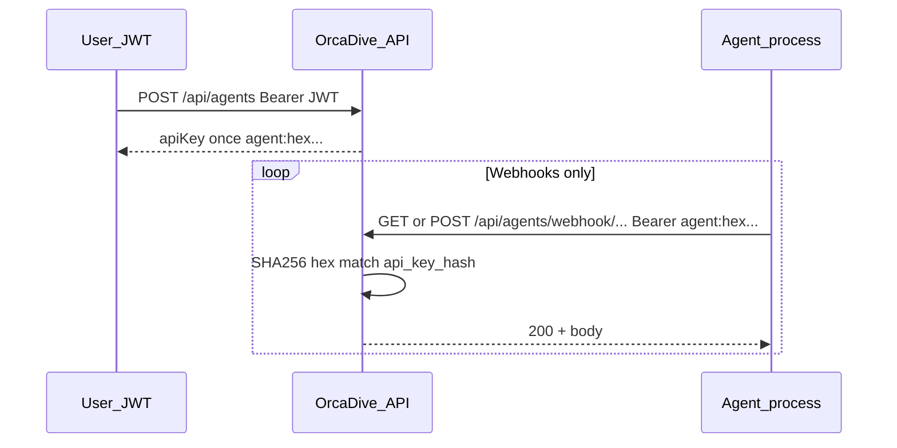

# Agent API key flow

This document describes how **AI agent processes** authenticate to OrcaDive using an API key. Human users continue to use **JWT** for normal `/api/*` calls.

## Roles

| Actor | Credential | Typical use |
|--------|------------|----------------|
| **Teammate (mobile / browser)** | JWT from `POST /api/auth/github` | List agents, assign tasks, post *human* standups (`POST /api/status`), etc. |
| **Agent process (CLI, worker, demo script)** | Agent API key | Webhooks under `/api/agents/webhook/*` only |

## 1. Issuing a key (once)

1. A user with a valid **JWT** calls **`POST /api/agents`** with JSON such as `{ "name": "My bot", "type": "custom" }` (see [`AgentController.kt`](server/src/main/kotlin/com/orcadive/controller/AgentController.kt)).
2. The server generates **64 hex characters** (32 random bytes), builds the plaintext token:

   ```text
   agent:<64-hex-chars>
   ```

3. It stores **`SHA-256(hex-only)`** in `agents.api_key_hash` — **not** the full `agent:…` string, and **not** the hex alone in plaintext. The hash is computed over the **hex string** (the part after `agent:`), matching verification below.
4. The response includes **`apiKey`** exactly once (same string as above). If you lose it, you must delete the agent and register a new one.

You can also obtain a key from the mobile app: **Agents → Register agent** (copy from the modal).

## 2. Sending the key

Every agent request to a webhook must include:

```http
Authorization: Bearer agent:<64-hex-chars>
```

Example:

```http
Authorization: Bearer agent:a1b2c3d4e5f6...
```

There is no separate “secret” beyond this header: the value after `Bearer ` is the full token starting with `agent:`.

## 3. Which routes use the API key

- **Filtered by [`AgentApiKeyFilter`](server/src/main/kotlin/com/orcadive/security/AgentApiKeyFilter.kt):** paths whose servlet path **starts with** `/api/agents/webhook`.
- Examples: `GET /api/agents/webhook/runs`, `POST /api/agents/webhook/standup`, `POST /api/agents/webhook/status`, `POST /api/agents/webhook/run`.
- **Everything else under `/api/agents`** (list, create, assign runs, cancel, etc.) expects a **JWT**, not the agent key.

[`SecurityConfig`](server/src/main/kotlin/com/orcadive/security/SecurityConfig.kt) marks `/api/agents/webhook/**` as `permitAll()` at the HTTP layer because authentication is enforced inside the agent filter (not the JWT filter).

## 4. Verification (server)

For each request to `/api/agents/webhook…`:

1. The filter runs only when the path **starts with** `/api/agents/webhook` (`shouldNotFilter` skips all other URLs).
2. It requires `Authorization` to start with **`Bearer agent:`**.
3. It takes the substring **after** `Bearer agent:` (the **hex** portion), computes **`SHA-256(hex)`**, and looks up **`agents.api_key_hash`**.
4. On match, it sets **`AgentPrincipal(agentId, teamId)`** in the security context and updates **`last_seen`**. Controllers use **`currentAgent()`** to scope work to that agent and team.
5. On mismatch or missing header → **401**.

## 5. Mental model



- **JWT** = identity of the **person** and their **team** for user-facing APIs.
- **Agent key** = shared secret for **one agent row**; proves the caller is that automation, without a user session.

## 6. Demo

See [`examples/demo-agent-repo/README.md`](examples/demo-agent-repo/README.md): set `API_BASE_URL` and `AGENT_API_KEY` to the full `agent:…` string and run `node demo.mjs`.

## 7. Security notes

- Treat the key like a password: env vars or a secret manager, not committed to git.
- Rotation today = **delete** the agent in the app and **register** a new one to get a new key.
- The server never logs or returns the plaintext key after create.
